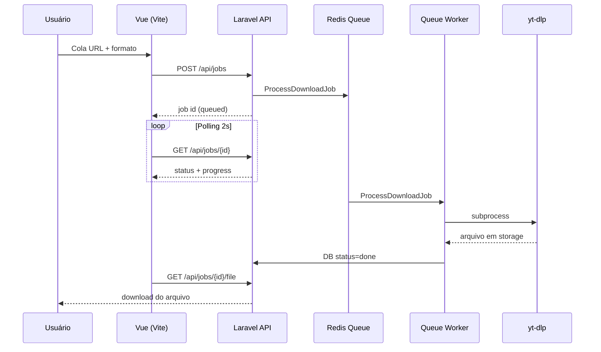

# Arquitetura — Malu

Serviço para baixar mídia via [yt-dlp](https://github.com/yt-dlp/yt-dlp), com API Laravel, fila Redis e frontend Vue.

## Visão geral



## Componentes

| Camada | Responsabilidade |
|--------|------------------|
| **Vue** (`resources/js`) | Formulário, polling, link de download |
| **API** (`routes/api.php`) | Criar job, consultar status, servir arquivo |
| **ProcessDownloadJob** | Executa yt-dlp de forma assíncrona |
| **YtDlpService** | Monta comando, lê progresso, resolve path |
| **DownloadMaintenanceService** | Timeout de jobs presos, limpeza de arquivos |
| **SQLite / Postgres** | Metadados do job (`downloads`) |
| **storage/app/private** | Arquivos baixados em `downloads/{uuid}/` |

## Estados do job

```
queued → processing → done
                   ↘ failed
```

- **queued:** criado pela API, aguardando worker.
- **processing:** worker rodando yt-dlp.
- **done:** arquivo disponível em `file_path`.
- **failed:** erro do yt-dlp, timeout ou falha do worker.

## Segurança

- Rate limit por IP (`POST` mais restrito que `GET`).
- URLs só `http`/`https`, sem IPs privados (anti-SSRF).
- `file_path` restrito ao prefixo `downloads/`.
- Job com timeout alinhado a `YTDLP_TIMEOUT`.

## Docker

Para subir app + Redis + worker + scheduler:

```bash
docker compose up --build
```

Detalhes em [DOCKER.md](DOCKER.md).

Deploy em produção: [DEPLOY.md](DEPLOY.md).

## CI/CD

GitHub Actions (`.github/workflows/ci.yml`):

- `php artisan test`
- `pint --test`
- Build da imagem Docker (`production`)

## Operação

| Comando | Frequência (scheduler) | Função |
|---------|------------------------|--------|
| `downloads:expire-stale` | 5 min | Marca jobs presos como `failed` |
| `downloads:cleanup` | 1 h | Remove arquivos/registros antigos |

Em produção:

```bash
php artisan queue:work --tries=1 --timeout=630
php artisan schedule:run  # via cron a cada minuto
```

## Variáveis principais

Ver `.env.example` — destaques:

- `QUEUE_CONNECTION=redis`
- `YTDLP_BINARY`, `YTDLP_TIMEOUT`
- `DOWNLOAD_STALE_*`, `DOWNLOAD_RETENTION_HOURS`
- `DOWNLOAD_RATE_LIMIT_*`

## Testes

```bash
php artisan test
```

- **Feature:** API, rate limit, ciclo de vida do job (yt-dlp mockado).
- **Unit:** validação de URL, manutenção, regras isoladas.
